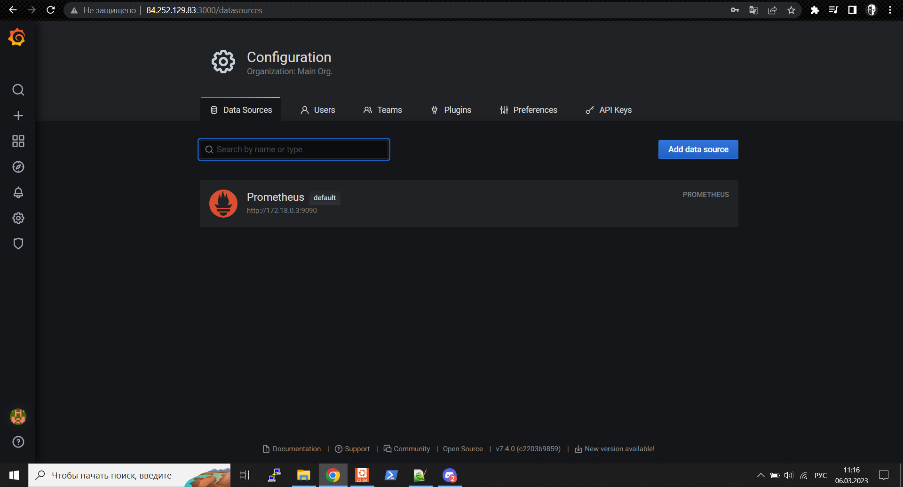
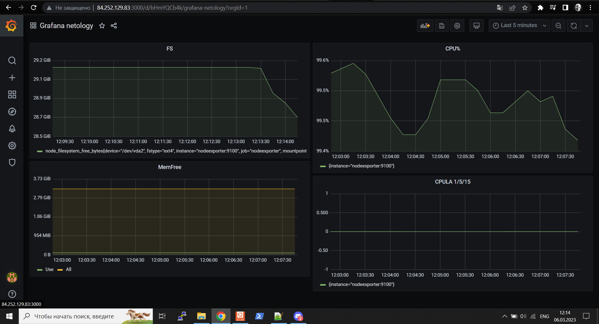
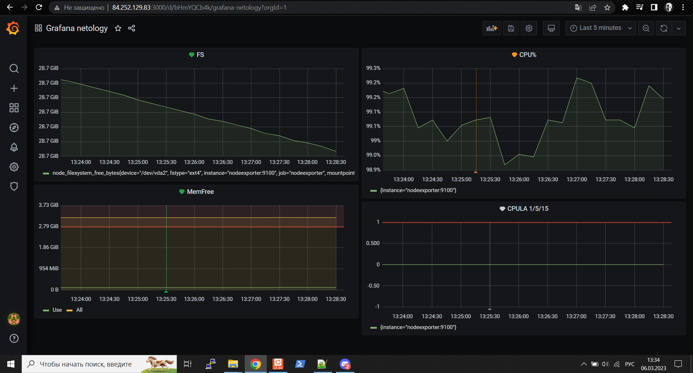

# Домашнее задание к занятию "10.03. Grafana"

### Задание 1

1. Используя директорию [help](./help) внутри этого домашнего задания, запустите связку prometheus-grafana.
1. Зайдите в веб-интерфейс grafana, используя авторизационные данные, указанные в манифесте docker-compose.
1. Подключите поднятый вами prometheus, как источник данных.
1. Решение домашнего задания — скриншот веб-интерфейса grafana со списком подключенных Datasource.



## Задание 2
Изучите самостоятельно ресурсы:
- [PromQL query to find CPU and memory](https://stackoverflow.com/questions/62770744/promql-query-to-find-cpu-and-memory-used-for-the-last-week)
- [PromQL tutorial](https://valyala.medium.com/promql-tutorial-for-beginners-9ab455142085)
- [Understanding Prometheus CPU metrics](https://www.robustperception.io/understanding-machine-cpu-usage)

Создайте Dashboard и в ней создайте следующие Panels:

#### Решение

- Утилизация CPU для nodeexporter (в процентах, 100-idle)

```bash
avg by(instance)(rate(node_cpu_seconds_total{mode="idle"}[$__rate_interval])) * 100
```

- CPULA 1/5/15

```bash
avg by (instance)(rate(node_load1{}[$__rate_interval]))
avg by (instance)(rate(node_load5{}[$__rate_interval]))
avg by (instance)(rate(node_load15{}[$__rate_interval]))
```

- Количество свободной оперативной памяти

```bash
node_memory_MemFree_bytes
node_memory_MemAvailable_bytes
```

- Количество места на файловой системе

```bash
node_filesystem_free_bytes{fstype="ext4"}
```


Для решения данного ДЗ приведите promql запросы для выдачи этих метрик, а также скриншот получившейся Dashboard.



## Задание 3

1. Создайте для каждой Dashboard подходящее правило alert — можно обратиться к первой лекции в блоке «Мониторинг».
1. В качестве решения задания приведите скриншот вашей итоговой Dashboard.



## Задание 4
Сохраните ваш Dashboard.

Для этого перейдите в настройки Dashboard, выберите в боковом меню "JSON MODEL".

Далее скопируйте отображаемое json-содержимое в отдельный файл и сохраните его.

В решении задания - приведите листинг этого файла.

#### Решение

- [dash.json](https://github.com/F1oMaCTeP/devops-netology1/tree/main/10-monitoring-03-grafana/pic/Grafana_netology-1678099505080.json)


