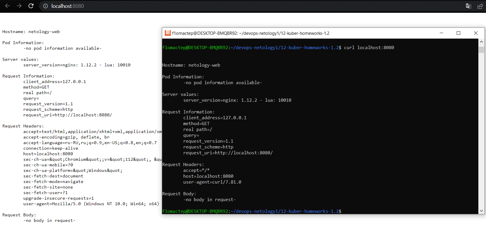
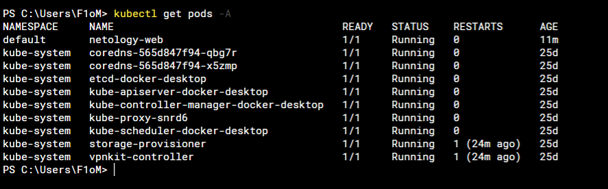

# Домашнее задание к занятию «Базовые объекты K8S»

### Цель задания

В тестовой среде для работы с Kubernetes, установленной в предыдущем ДЗ, необходимо развернуть Pod с приложением и подключиться к нему со своего локального компьютера.

------

### Правила приёма работы

1. Домашняя работа оформляется в своем Git-репозитории в файле README.md. Выполненное домашнее задание пришлите ссылкой на .md-файл в вашем репозитории.
2. Файл README.md должен содержать скриншоты вывода команд `kubectl get pods`, а также скриншот результата подключения.
3. Репозиторий должен содержать файлы манифестов и ссылки на них в файле README.md.

------

1) [MANIFEST](https://github.com/F1oMaCTeP/devops-netology1/tree/main/12-kuber-homeworks-1.2/Hello-world.yml)
    
2) [MANIFEST](https://github.com/F1oMaCTeP/devops-netology1/tree/main/12-kuber-homeworks-1.2/Web.yml)
    
    
