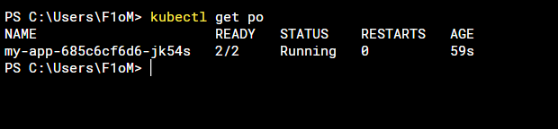
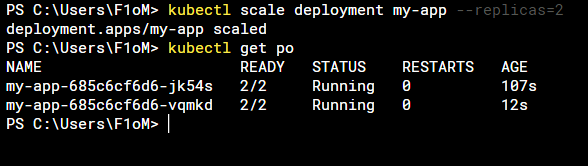
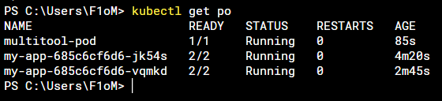
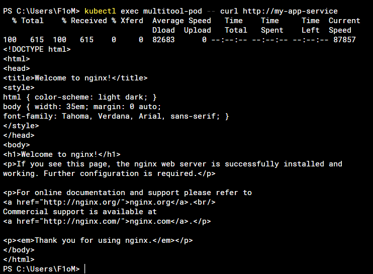
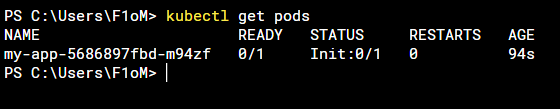
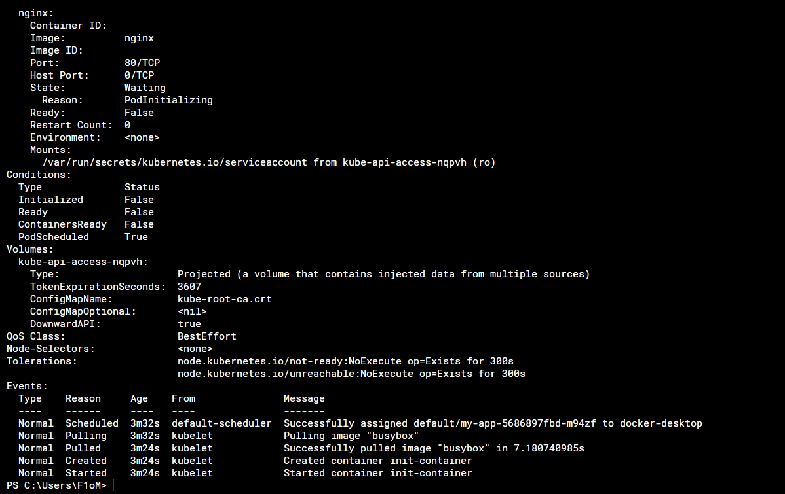
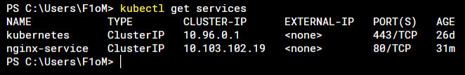

# Домашнее задание к занятию «Запуск приложений в K8S»

### Цель задания

В тестовой среде для работы с Kubernetes, установленной в предыдущем ДЗ, необходимо развернуть Deployment с приложением, состоящим из нескольких контейнеров, и масштабировать его.

------

1) [Deploy](https://github.com/F1oMaCTeP/devops-netology1/tree/main/12-kuber-homeworks-1.3/1/deploy.yaml),
[services](https://github.com/F1oMaCTeP/devops-netology1/tree/main/12-kuber-homeworks-1.3/1/services.yaml), [pod](https://github.com/F1oMaCTeP/devops-netology1/tree/main/12-kuber-homeworks-1.3/1/pod.yaml).
   
   
   
   
------
2) [Deploy](https://github.com/F1oMaCTeP/devops-netology1/tree/main/12-kuber-homeworks-1.3/2/nginx-deployment.yaml), [services](https://github.com/F1oMaCTeP/devops-netology1/tree/main/12-kuber-homeworks-1.3/2/nginx-service.yaml)
   
   
   