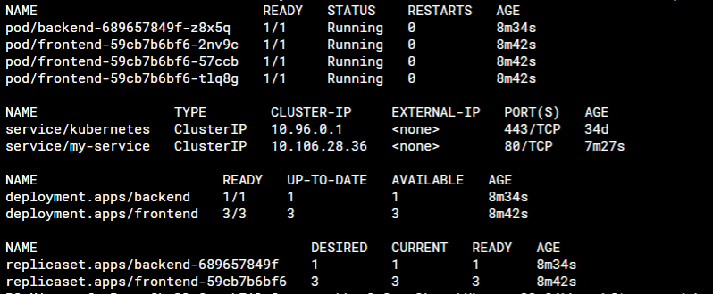
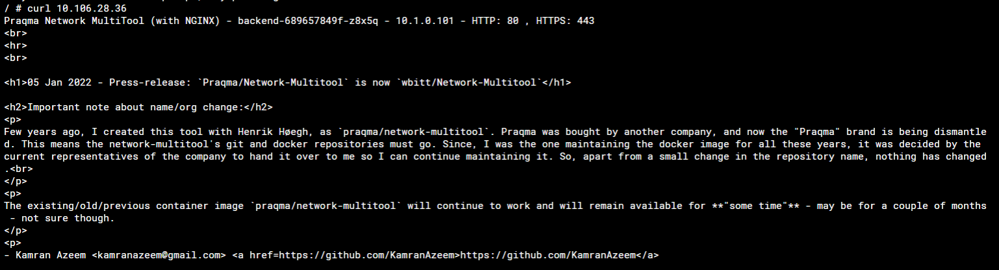

# Домашнее задание к занятию "Сетевое взаимодействие в K8S. Часть 2"

------

### Задание 1. Создать Deployment приложений backend и frontend

1. Создать Deployment приложения _frontend_ из образа nginx с кол-вом реплик 3 шт.
2. Создать Deployment приложения _backend_ из образа multitool.
3. Добавить Service'ы, которые обеспечат доступ к обоим приложениям внутри кластера.
4. Продемонстрировать, что приложения видят друг друга с помощью Service.
5. Предоставить манифесты Deployment'а и Service в решении, а также скриншоты или вывод команды п.4.

------
- [Front](1/frontend-deployment.yaml)
- [Back](1/backend-deployment.yaml)
- [Svc](1/my-service.yaml)






------

### Задание 2. Создать Ingress и обеспечить доступ к приложениям снаружи кластера

------

- [Ing](1/ingress.yaml)


```bash
$curl 192.168.65.4
<!DOCTYPE html>
<html>
<head>
<title>Welcome to nginx!</title>
<style>
    body {
        width: 35em;
        margin: 0 auto;
        font-family: Tahoma, Verdana, Arial, sans-serif;
    }
</style>
</head>
<body>
<h1>Welcome to nginx!</h1>
<p>If you see this page, the nginx web server is successfully installed and
working. Further configuration is required.</p>

<p>For online documentation and support please refer to
<a href="http://nginx.org/">nginx.org</a>.<br/>
Commercial support is available at
<a href="http://nginx.com/">nginx.com</a>.</p>

<p><em>Thank you for using nginx.</em></p>
</body>
</html>
```

```bash
$ curl 192.168.65.4/api
% Total    % Received % Xferd  Average Speed   Time    Time     Time  Current
                                 Dload  Upload   Total   Spent    Left  Speed
100   141  100   141    0     0  15636      0 --:--:-- --:--:-- --:--:-- 15636
WBITT Network MultiTool (with NGINX) - backend-5596b5d66d-mqm4m - 10.1.128.243 - HTTP: 80 , HTTPS: 443 . (Formerly praqma/network-multitool)
```